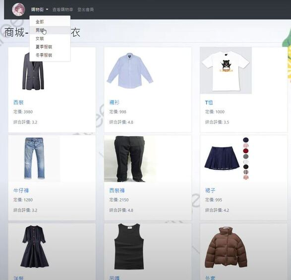
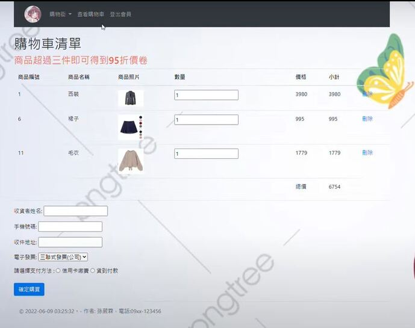
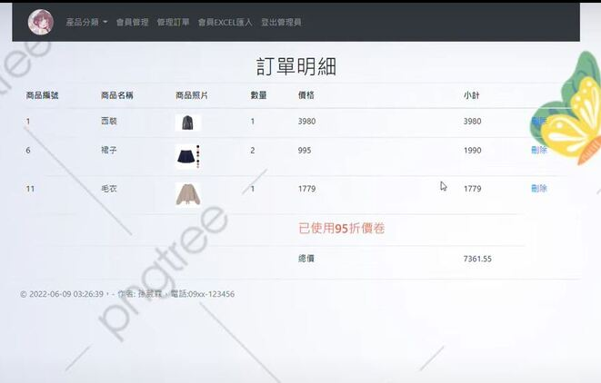

# 服裝購物車系統

一個基於 Laravel 架構的電子商務購物車系統，提供使用者註冊、購物車、訂單管理及管理員後台功能，適合作為電子商務系統的學習案例或開發基礎。

## 功能

### 一般使用者
* **會員註冊與登入**：安全的註冊和登入系統，基於 Session 認證。
* **產品市場**：按類別瀏覽產品、查看詳情並評價商品。
* **購物車**：添加產品、調整數量並將購物車轉為訂單。
* **訂單追蹤**：查看訂單歷史與詳情。

### 管理員
* **會員管理**：查看並刪除使用者帳戶。
* **訂單管理**：監控和管理所有訂單，並提供詳細視圖。
* **Excel 匯出/匯入**：將訂單匯出為 Excel 檔案，並從 Excel 匯入會員資料。

## 技術
* **後端**：Laravel 10.x, PHP 8.0+
* **前端**：Bootstrap 4.6, jQuery, Blade 模板
* **資料庫**：MySQL 8.0
* **依賴管理**：Composer, PhpOffice/PhpSpreadsheet（用於 Excel 功能）
* **伺服器**：XAMPP (Apache + MySQL)

## 環境需求
- PHP 8.0+
- MySQL 8.0
- XAMPP (Apache + MySQL)
- Composer

### 前置條件
* 已安裝XAMPP(Apache + MySQL)
* PHP 8.0(含 Composer）
  
### 安裝步驟
1. **安裝Laravel**
   
       $   cd  c:\xampp  
       $   composer  global  require  "laravel/installer"

2. 建立專案
   
       $  cd  c:\xampp\htdocs
   
       $  laravel  new  Laravel2022         (Laravel2022  是專案名稱)
   
       $   cd  c:\xampp\htdocs\Laravel2022
   
       ** 啟動 Apache**

4. 運行應用程式
   
       $ php artisan serve

       在 http://127.0.0.1:8000 訪問應用程式。

### 使用說明
* 首頁：http://127.0.0.1:8000/Home/Index
* 登入：使用 http://127.0.0.1:8000/Home/Login（可測試預設的管理員/會員角色）。
* 管理面板：使用管理員帳戶登入後可訪問。
* 資料庫管理：使用 http://127.0.0.1:8080/phpmyadmin。

 ## 預設帳號
 
    - 管理員：
    
        - 帳號: admin
        - 密碼: 123
        
    - 一般會員：
    
        - 帳號: ysp
        - 密碼: 123

## 首頁

**網站首頁**

## **商品列表**

## **< 商品首頁 >**

* 使用者點擊 LOGO 回到商品首頁
* 使用者點擊 購物街 可看到排序，有男裝、女裝、夏季服裝、冬季服裝
* 使用者點擊 查看購物車 可以瀏覽所有商品
* 使用者點擊 登出 即可登出使用者
* 使用者點擊加入商品，可以將商品放入到購物車內

## **購物車清單**

## **< 購物車頁面 >**

  * 使用者可以瀏覽購物車內所有商品資訊購買金額
  * 使用者點擊 數量 可以增加或減少商品數量
  * 使用者點擊 刪除 可以將商品移除購物車
  * 使用者需填寫姓名、電話、地址，並成立訂單

## **賣家詳情**

## **< 賣家畫面 >**

   * 賣家可以瀏覽買家的所有訂單
   * 賣家點擊 管理訂單，可以看到訂單詳情
   * 賣家點擊 會員EXCEL匯入，可將訂單匯入EXCEL

# **成品影片**

[📹 成品影片展示](https://youtu.be/xiUZ9yMX7gM?si=mcUuNrqO3NkUyWmc)

